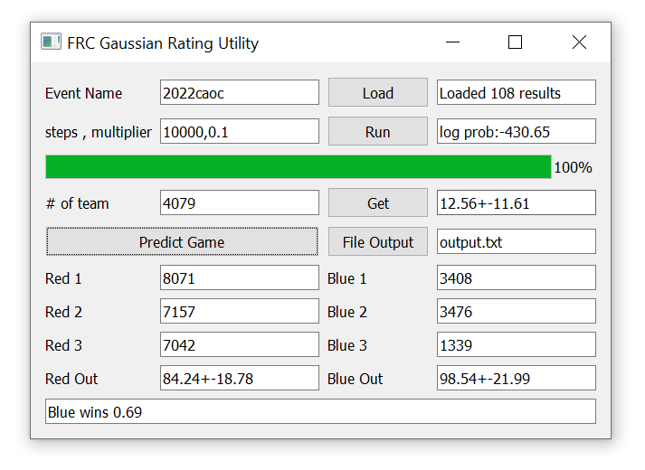

# What it does
This code uses a mathematical model to estimate the scoring potential of FRC teams using data from [The Blue Alliance](https://www.thebluealliance.com/). A simple GUI allows one to perform a few simple actions to load the data, calculate the model, and then predict the scoring potential of teams or alliances.

# How to use it
The python code depends on numpy, scipy, requests, and PyQt5.

Once GRU_GUI is run, the following window pops up:

Row by row one has:
- Event input
    - first textbox is input for the event string (found at the end of its TBA link)
    - the Load button allows one to load the data from said event
    - the second textbox displays the number of results loaded (2 per match)
- Calculation input
    - the first textbox is input for the number of steps and multiplier of the calculation
        - number of steps is mandatory and should be an integer
        - multiplier is optional and should be a float, usually less than 1
    - the Run button runs the calculation, displaying progress in the bar below
        - (sometimes the window freezes due to not responding as the calculation is done)
    - the second textbox is the output showing the logarithm of the relative probability of the result
        - closer to 0 is better
- Progress bar
    - displays progress for a calculation run
- Team value
    - the first textbox prompts for the # of a team in the event
    - the Get button retrieves the information for said team
    - the second textbox displays the calculated data for said team in the form "avg+-stdev"
- Game Prediction
    - the Predict Game button runs the prediction based on the 6 teams below
    - 6 textboxes are given for input of the red and blue alliances
    - 3 output boxes show the values for the Red and Blue alliances, as well as an estimate for the probability of winning for the stronger alliance
- File Output
    - the File Ouptut button prints the data for all teams in a text file with the given name
        - the data is sorted from highest to lowest average

# How it works
Each team is assigned an average and a variance. These values are non-negative, and the teams 'scoring potential' is modelled to be in a normal distribution. Conveniently, an alliances scoring potential ends up being a normal distribution as well, with the average and variance being summed over the teams involved.

The model ignores the impact of an opposing alliance on the score, which may discount the value of defensive play. However, the strongest teams are typically those with a lot of scoring potential.

The calculation seeks to find the optimal averages and variances such that the outcome seen so far is as likely as possible.
The relative probability of the existing scores can be calculated by using the modelled normal distributions.
This probability is maximized by using gradient ascent.